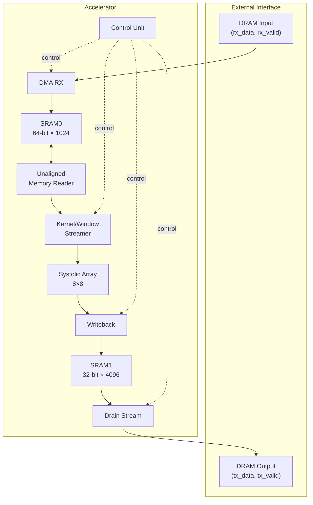
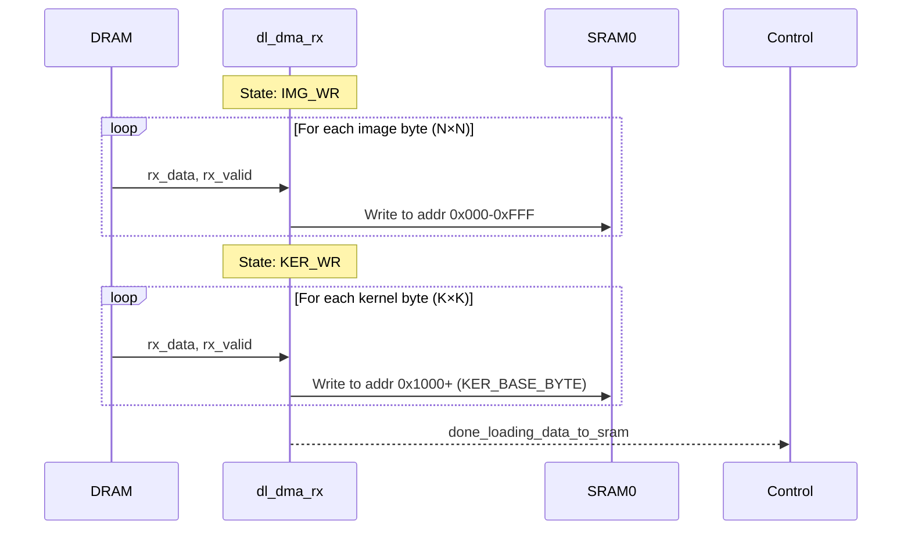
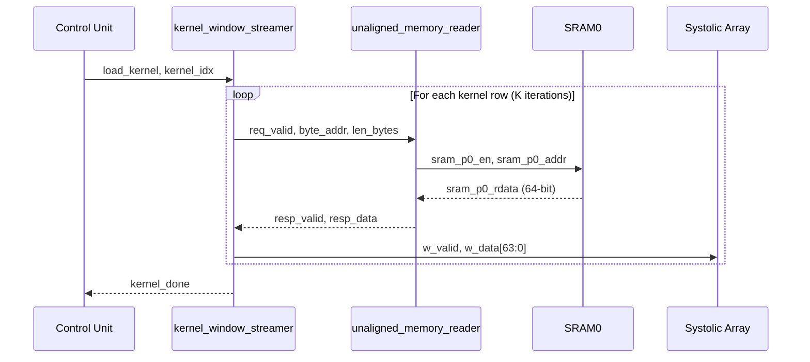
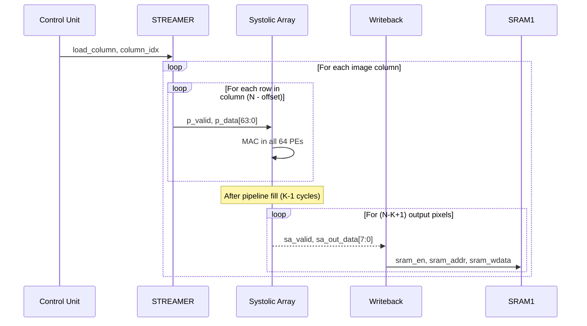
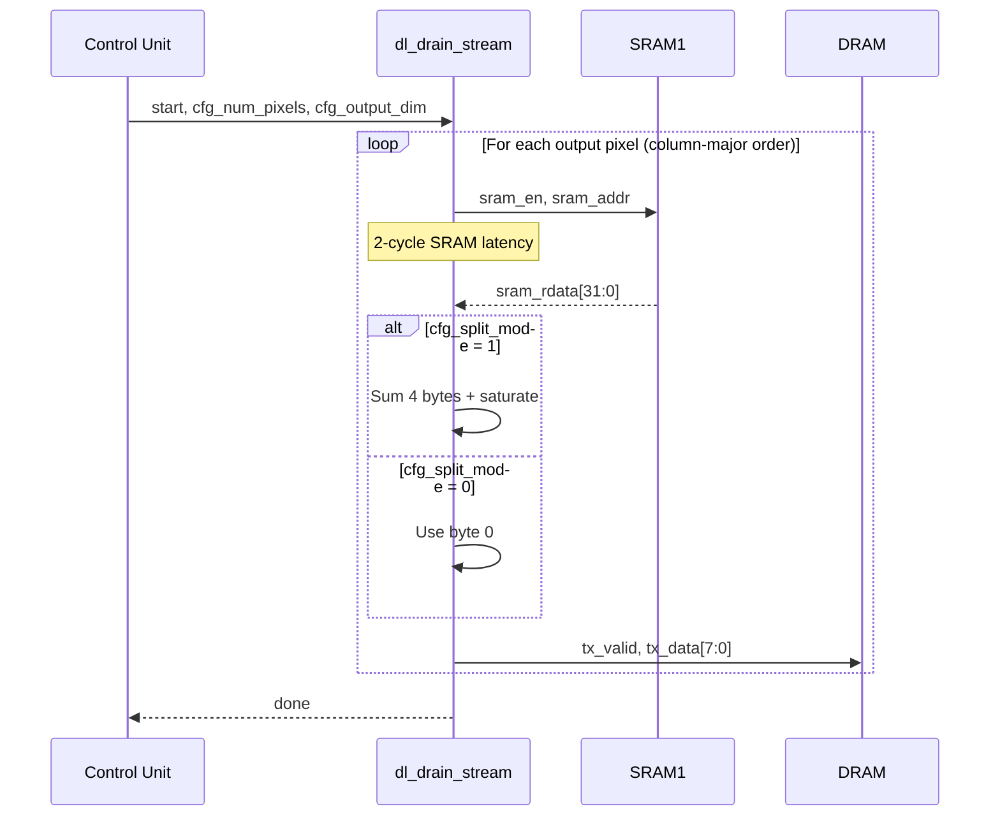
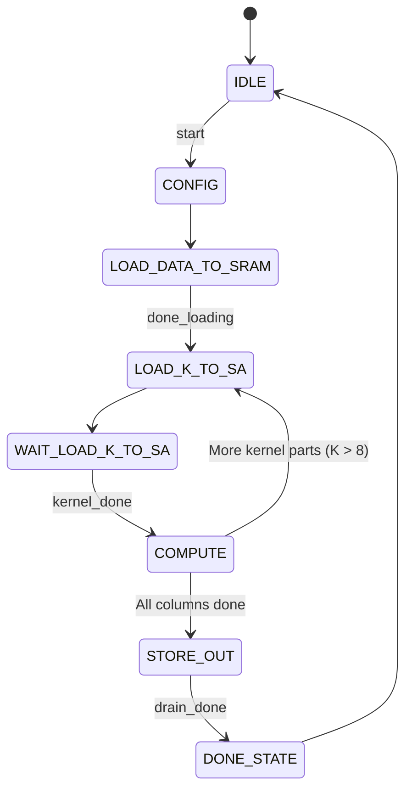
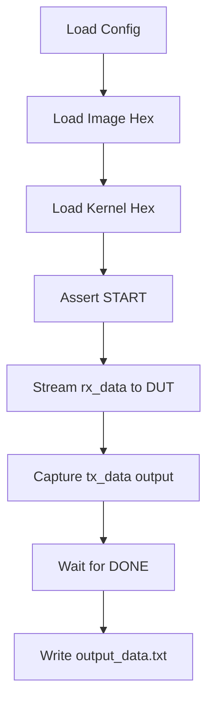

# Convolution Accelerator - Comprehensive Architecture Documentation

## Table of Contents
1. [System Overview](#system-overview)
2. [Top-Level Architecture](#top-level-architecture)
3. [Data Flow Pipeline](#data-flow-pipeline)
4. [Module Deep Dive](#module-deep-dive)
5. [Testbench Operation](#testbench-operation)
6. [Timing & Control](#timing--control)

---

## System Overview

This convolution accelerator is a hardware implementation for 2D convolution operations, commonly used in CNNs. It processes an **N×N image** with a **K×K kernel** to produce an **(N-K+1)×(N-K+1)** output.

### Key Features
- **8×8 Systolic Array** for parallel MAC operations
- **Dual-port SRAM** architecture for concurrent read/write
- **DMA-based data loading** from external DRAM
- **Split-kernel support** for kernels larger than 8×8 (up to 16×16)
- **Column-major output** for memory-efficient streaming



---

## Top-Level Architecture

### Module: [conv_accelerator_top](file:///home/ahmedfathy0-0/Documents/my%20projects/convolution-accelerator/rtl/conv_accelerator_top.v)

**Parameters:**
| Parameter | Default | Description |
|-----------|---------|-------------|
| `ADDR_W` | 10 | SRAM0 word address width (1024 words) |
| `BYTE_ADDR_W` | 13 | Byte address width (8KB) |
| `KER_BASE_BYTE` | 4096 | Kernel base address in SRAM0 |
| `IMG_BASE_BYTE` | 0 | Image base address in SRAM0 |
| `SRAM1_ADDR_W` | 12 | SRAM1 word address width (4096 words) |
| `SA_DIM` | 8 | Systolic array dimension |
| `SA_INPUT_FILL_TIME` | 8 | SA pipeline fill time |

**Port Interface:**
```
┌──────────────────────────────────────────────────────────┐
│                   conv_accelerator_top                    │
├──────────────────────────────────────────────────────────┤
│  INPUTS:                    │  OUTPUTS:                   │
│  • clk, rst_n               │  • done                     │
│  • start                    │  • rx_ready                 │
│  • cfg_N [6:0]              │  • tx_valid                 │
│  • cfg_K [4:0]              │  • tx_data [7:0]            │
│  • rx_data [7:0]            │                             │
│  • rx_valid                 │                             │
│  • tx_ready                 │                             │
└──────────────────────────────────────────────────────────┘
```

---

## Data Flow Pipeline

### Phase 1: Data Loading (DRAM → SRAM0)



**Memory Layout in SRAM0:**
```
Address 0x0000: Image data (N×N bytes, packed row-major)
Address 0x1000: Kernel data (K×K bytes, packed row-major)
```

---

### Phase 2: Kernel Loading to Systolic Array



---

### Phase 3: Convolution Compute



**Systolic Array Data Flow:**
```
        ┌─────────────────────────────────────────────┐
        │  input_in[63:0] = 8 pixels from image row   │
        │   [P7] [P6] [P5] [P4] [P3] [P2] [P1] [P0]   │
        └──────────┬──────────────────────────────────┘
                   ▼
      ┌───┐ ┌───┐ ┌───┐ ┌───┐ ┌───┐ ┌───┐ ┌───┐ ┌───┐
 K0 ──│PE │─│PE │─│PE │─│PE │─│PE │─│PE │─│PE │─│PE │── K7
      │0,0│ │0,1│ │0,2│ │0,3│ │0,4│ │0,5│ │0,6│ │0,7│
      └─┬─┘ └─┬─┘ └─┬─┘ └─┬─┘ └─┬─┘ └─┬─┘ └─┬─┘ └─┬─┘
        ▼     ▼     ▼     ▼     ▼     ▼     ▼     ▼
      ┌───┐ ┌───┐ ┌───┐ ┌───┐ ┌───┐ ┌───┐ ┌───┐ ┌───┐
 K8 ──│PE │─│PE │─│PE │─│PE │─│PE │─│PE │─│PE │─│PE │── K15
      │1,0│ │1,1│ │1,2│ │1,3│ │1,4│ │1,5│ │1,6│ │1,7│
      └─┬─┘ └─┬─┘ └─┬─┘ └─┬─┘ └─┬─┘ └─┬─┘ └─┬─┘ └─┬─┘
        ⋮     ⋮     ⋮     ⋮     ⋮     ⋮     ⋮     ⋮
      
 Each PE: out_partial = kernel_weight × input_pixel
 Sum of all 64 partials → output pixel (clamped to 8 bits)
```

---

### Phase 4: Result Drain (SRAM1 → DRAM)



---

## Module Deep Dive

### Control Unit

**File:** [control_unit.v](file:///home/ahmedfathy0-0/Documents/my%20projects/convolution-accelerator/rtl/control_unit/control_unit.v)

**State Machine:**


**Split-Kernel Support (K > 8):**
When kernel size exceeds SA dimension, kernel is split into 4 quadrants:
```
┌───────────────┬───────────────┐
│ Quadrant 0    │ Quadrant 1    │
│ (idx=0)       │ (idx=1)       │
│ Top-Left      │ Top-Right     │
├───────────────┼───────────────┤
│ Quadrant 2    │ Quadrant 3    │
│ (idx=2)       │ (idx=3)       │
│ Bottom-Left   │ Bottom-Right  │
└───────────────┴───────────────┘
```

---

### DMA RX Module

**File:** [dl_dma_rx.v](file:///home/ahmedfathy0-0/Documents/my%20projects/convolution-accelerator/rtl/data-loader-agu/src/dl_dma_rx.v)

Receives byte-wide data from DRAM and packs into 64-bit SRAM words.

**Byte Lane Selection:**
```verilog
wire [2:0] lane    = byte_ptr[2:0];           // Which byte lane (0-7)
wire [5:0] shamt   = {lane, 3'b000};          // Shift amount (lane × 8)
wire [63:0] wdata  = rx_data << shamt;        // Position byte in word
wire [7:0]  wmask  = 8'b1 << lane;            // Enable specific byte
```

---

### Unaligned Memory Reader

**File:** [byte_window_streamer.v](file:///home/ahmedfathy0-0/Documents/my%20projects/convolution-accelerator/rtl/data-loader-agu/src/byte_window_streamer.v)

Reads arbitrary byte-aligned data from 64-bit SRAM. Uses both SRAM ports to handle cross-word-boundary reads.

**Pipeline Timing (2 cycles):**
```
Cycle 0: Request in, SRAM address computed
Cycle 1: SRAM read data available (p0_rdata, p1_rdata)
Cycle 2: Result shifted/masked and output
```

**Cross-Boundary Read Example:**
```
SRAM Word N:   [B7 B6 B5 B4 B3 B2 B1 B0]
SRAM Word N+1: [B7 B6 B5 B4 B3 B2 B1 B0]
                        └────┬────┘
                  Request: addr offset=5, len=4
Combined:      [Word N+1 | Word N] >> 40 & 0xFFFFFFFF
```

---

### Kernel/Window Streamer

**File:** [kernel_window_streamer.v](file:///home/ahmedfathy0-0/Documents/my%20projects/convolution-accelerator/rtl/data-loader-agu/src/kernel_window_streamer.v)

Orchestrates data streaming for both kernel loading and image window streaming.

**Two Modes:**
1. **LOAD_KERNEL**: Reads kernel rows from KER_BASE_BYTE
2. **STREAM_WIN**: Reads image columns from IMG_BASE_BYTE + column offset

---

### Processing Element (PE)

**File:** [pe.v](file:///home/ahmedfathy0-0/Documents/my%20projects/convolution-accelerator/rtl/systolic_array/pe.v)

Each PE performs a single multiply operation per cycle.

```verilog
// Kernel weight stored in left_reg (loaded once)
// Pixel data flows through top_reg (every cycle)

assign out_partial = pe_enable ? (left_reg * top_reg) : 0;
assign out_down    = top_reg;   // Pass pixel to next row
assign out_right   = left_reg;  // Pass to next column (unused in this design)
```

---

### Systolic Array

**File:** [systolic_array.v](file:///home/ahmedfathy0-0/Documents/my%20projects/convolution-accelerator/rtl/systolic_array/systolic_array.v)

8×8 array of PEs computing dot product of kernel × image window.

**Output Computation:**
```verilog
// Sum all 64 partial products
always @(*) begin
    sum_partials = 0;
    for (n = 0; n < 8; n = n + 1)
        for (m = 0; m < 8; m = m + 1)
            sum_partials = sum_partials + pe_out_partials[n][m];
end
```

---

### SA Writeback

**File:** [dl_sa_writeback.v](file:///home/ahmedfathy0-0/Documents/my%20projects/convolution-accelerator/rtl/data-loader-agu/src/dl_sa_writeback.v)

Buffers SA outputs and writes to SRAM1 using byte-lane masking for split-kernel accumulation.

**FIFO Buffer:** 8-entry × 8-bit to absorb SA output burst

**Address Stride:** Increments by 1 word per write (kernel_idx selects byte lane for accumulation)

---

### Drain Stream

**File:** [dl_drain_stream.v](file:///home/ahmedfathy0-0/Documents/my%20projects/convolution-accelerator/rtl/data-loader-agu/src/dl_drain_stream.v)

Reads output from SRAM1 and streams to DRAM byte-by-byte.

**Column-Major Addressing:**
```verilog
// Converts (row, col) to column-major address
wire [ADDR_W-1:0] sram_addr_calc = read_col * cfg_output_dim + read_row;
```

**Split-Mode Summation:**
When K > 8, four partial results are summed with saturation:
```verilog
sum_temp = sram_rdata[7:0] + sram_rdata[15:8] + 
           sram_rdata[23:16] + sram_rdata[31:24];
computed_pixel = (sum_temp > 255) ? 8'hFF : sum_temp[7:0];
```

---

## Testbench Operation

### File: [tb_conv_accel_simple.v](file:///home/ahmedfathy0-0/Documents/my%20projects/convolution-accelerator/rtl/tb/tb_conv_accel_simple.v)

**Test Case Structure:**
```
test_cases/
├── 01_Basic_Minimal_config.txt
├── 01_Basic_Minimal_in.hex
├── 01_Basic_Minimal_weight.hex
├── 02_Basic_Identity_config.txt
├── ...
└── 10_Pro_Saturation_*.{txt,hex}
```

**Test Flow:**


**Config File Format:**
```
N=10
K=3
Output_Size=64
```

---

## Timing & Control

### Pipeline Latency Summary

| Stage | Latency (cycles) |
|-------|------------------|
| DMA Write to SRAM | 1 |
| Memory Reader | 2 |
| SA Pipeline Fill | K-1 (or half-K for split) |
| SA Valid Delay | SA_INPUT_FILL_TIME + SA_DIM |
| Writeback FIFO | 0-8 (depends on fill) |
| Drain SRAM Read | 2 |

### Control Signals Timing

```
start          ───┐
                  └─────────────────────────────────────
                  
load_kernel    ────────────────┐  ┐  ┐  ┐
                               └──┴──┴──┴───────────────
                               
load_column    ─────────────────────────┐  ┐  ┐  ...
                                        └──┴──┴────────
                                        
systolic_valid ───────────────────────────────┐  ┐  ...
                                              └──┴─────
                                              
done           ────────────────────────────────────────┐
                                                       └
```

---

## Memory Map

### SRAM0 (Input Buffer - 8KB)
| Address Range | Content |
|---------------|---------|
| 0x0000 - 0x0FFF | Image data (N×N bytes) |
| 0x1000 - 0x10FF | Kernel data (K×K bytes) |

### SRAM1 (Output Buffer - 16KB)  
| Address Range | Content |
|---------------|---------|
| 0x000 - 0xFFF | Output pixels (column-major, 1 byte/word for normal, 4 bytes/word for split) |

---

## Configuration Constraints

| Parameter | Min | Max | Notes |
|-----------|-----|-----|-------|
| N (Image Size) | 2 | 64 | Power of 2 recommended |
| K (Kernel Size) | 1 | 16 | Split mode for K > 8 |
| Output Size | 1 | 63 | = N - K + 1 |
