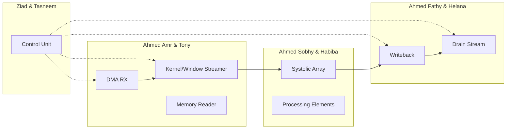

# Convolution Accelerator - Team Contributions

## Project Team

| Team Members | Module/Component | Description |
|--------------|------------------|-------------|
| **Ziad Montaser** & **Tasneem Mohamed** | Control Unit | FSM design, state sequencing, split-kernel orchestration |
| **Ahmed Fathy** & **Helana** | Writeback & Output Drain | SA to SRAM1 writeback, SRAM1 to DRAM streaming |
| **Ahmed Amr** & **Tony** | DMA & Kernel/Window Streamer | DRAM to SRAM0 loading, data streaming to SA |
| **Ahmed Sobhy** & **Habiba** | Systolic Array | 8×8 PE array, MAC operations |

---

## Module Ownership

---

## Files by Team

### Control Unit Team (Ziad Montaser & Tasneem Mohamed)
- `rtl/control_unit/control_unit.v`
- `rtl/control_unit/tb_control_unit.v`

### DMA & Streamer Team (Ahmed Amr & Tony)
- `rtl/data-loader-agu/src/dl_dma_rx.v`
- `rtl/data-loader-agu/src/kernel_window_streamer.v`
- `rtl/data-loader-agu/src/byte_window_streamer.v`

### Systolic Array Team (Ahmed Sobhy & Habiba)
- `rtl/systolic_array/systolic_array.v`
- `rtl/systolic_array/pe.v`

### Writeback & Drain Team (Ahmed Fathy & Helana)
- `rtl/data-loader-agu/src/dl_sa_writeback.v`
- `rtl/data-loader-agu/src/dl_drain_stream.v`
